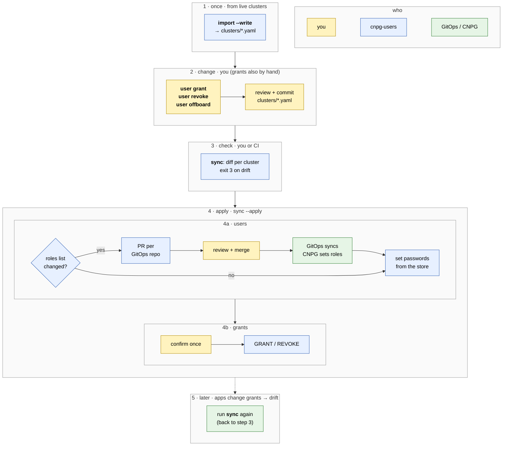

# cnpg-users-grants

Access control for [CloudNativePG](https://cloudnative-pg.io) clusters deployed through GitOps: manage people's access on every cluster from one place, and keep application roles' grants in code with drift detection.

Nothing changes a database or repo unless you pass `--apply`. Postgres is reached through `kubectl exec` into the primary pod, so a kubeconfig is all it needs: no network path to the database and no database credentials.

## Approach

- **One place for human roles.** Which people have a role on which cluster, and with what memberships, is tracked in `clusters/`, one file per CNPG cluster. `user grant` / `revoke` / `offboard` edit them across all clusters at once, and the tool turns those edits into one PR per GitOps repo. App roles stay wherever they're declared now; they're only listed by name.
- **CNPG manages the roles.** Human roles are declared as the cluster's [managed roles](https://cloudnative-pg.io/documentation/current/declarative_role_management/) in whatever YAML your GitOps repo deploys it from, and the operator creates, alters and drops them. The tool never does that over SQL; it changes the declaration.
- **Passwords stored centrally.** Each person's password lives once in your secret store (AWS SSM, GCP Secret Manager or sops). A cluster only receives the SCRAM verifier, which Postgres keeps anyway, so no cluster holds a plaintext copy in a Kubernetes Secret.
- **Grants as code, with drift detection.** CNPG has no declaration for grants, so every role's grants, apps included, are kept in the cluster files; `import` snapshots them from the live cluster. `sync-grants` prints the `GRANT`/`REVOKE` that fixes any drift and exits non-zero, so it fits CI.
- **Run by people, from their machines.** It's a CLI that uses your own kubeconfig, Git login and store access, with nothing to deploy. Changes stay small and reviewed, which suits small and medium teams where a few people look after database access.

## Workflow



## Quick start

Requires [uv](https://docs.astral.sh/uv/) and a kubeconfig with access to the clusters; that's all `sync-grants` needs. `import` also reads the password store, and managing humans needs `gh` logged in with access to the GitOps repos, where each cluster's CNPG roles list sits in a YAML file: a `Cluster` manifest, Helm values, a Kustomize patch or anything else that's plain YAML (one document per file).

<!-- x-release-please-start-version -->
```sh
mkdir cnpg-users-grants && cd cnpg-users-grants   # configs live in the directory you run from
cat > user_passwords_store.yaml <<'EOF'
type: aws-ssm                      # or gcp-secret-manager / sops, see Files below
aws_profile: default
aws_region: eu-central-1
aws_ssm_prefix: /cnpg-user/
EOF
mkdir clusters && cat > clusters/cloudnative-pg.my-app.prod.yaml <<'EOF'
context: my-kube-context
namespace: my-app
cluster: cloudnative-pg
repo: my-org/argocd
values_file: prod/my-app/cloudnative-pg/values.yaml
values_roles_path: roles           # see Files below
EOF

# fill humans/apps/grants from the live cluster
uvx --from git+https://github.com/caseycs/cnpg-users-grants@v0.2.0 cnpg-users import cloudnative-pg.my-app.prod --write
# what differs, users and grants?
uvx --from git+https://github.com/caseycs/cnpg-users-grants@v0.2.0 cnpg-users sync
```
<!-- x-release-please-end -->

<!-- x-release-please-start-version -->
`uvx` fetches and caches the tool on first use. The examples pin the latest release (`@v0.2.0`); drop the `@…` to track `main`, or `uv tool install git+https://github.com/caseycs/cnpg-users-grants@v0.2.0` to keep `cnpg-users` on your PATH.
<!-- x-release-please-end -->

## Commands

| Command | What it does |
|---|---|
| `import <cluster> [--write] [--prune]` | Read roles and grants from the live cluster, show the diff against `clusters/<cluster>.yaml`; `--write` saves it. |
| `sync [<cluster>…] [--apply]` | Both of the below in one run: one report per cluster with users and grants; `--apply` does the users flow first, then grants (asks first). |
| `sync-grants [<cluster>…]` | Print the SQL that makes live grants match the file. |
| `sync-grants --apply [--yes]` | Run it: asks first (`--yes` skips, e.g. in CI), one transaction per database, then re-checks. |
| `sync-users [<cluster>…]` | Print the roles-list change and password statements for humans. |
| `sync-users --apply` | Open one PR per GitOps repo, wait for a person to merge it and GitOps to sync it, then set passwords. |
| `user grant <name> <cluster>… [--role R]… [--superuser]` | Add or update a human in these cluster files (default role `pg_read_all_data`). |
| `user revoke <name> <cluster>…` | Mark the human `ensure: absent` there and drop their `grants:`. |
| `user offboard <name>` | `revoke` in every cluster file they're in. |
| `user list [<name>]` | Who has what, across all cluster files. |

Without cluster names, `sync` and `sync-*` run for every file in `clusters/`, `--parallel N` at a time (default 4). Exit codes: `0` in sync, `3` drift, `1` error, `2` usage.

## Granting and offboarding people

`user …` only edits the cluster files (review the diff and commit it); `sync-users --apply` applies them.

```sh
cnpg-users user grant alice cloudnative-pg.my-app.prod          # 1. config
cnpg-users sync-users --apply                                    # 2. PR adds the role, then her stored password is set
```

```sh
cnpg-users user offboard alice                                   # 1. ensure: absent + her grants removed, everywhere
cnpg-users sync-users                                            #    shows what still blocks dropping her role
cnpg-users sync-users --apply                                    # 2. PR marks her role ensure: absent in the roles list
cnpg-users sync-grants --apply                                   #    REVOKE the grants she still holds
```

`sync-users --apply` labels its PRs `cnpg-users-grants` and updates an open one instead of opening another. It then checks the clusters every 10 seconds for up to `--apply-timeout` (default 180 s) and sets passwords once the roles exist. If nobody merges in time, it stops; run it again after the merge.

CNPG can't drop a role that still owns objects or holds privileges. `sync-users` lists those per database with the `REASSIGN OWNED … DROP OWNED …` to run first. Roles are cluster-wide, so a human in a cluster file can log in to every database of that cluster; `grants:` are per database. Passwords are generated in the store on first `--apply` if missing, and aren't deleted on offboarding.

## Files

`clusters/<cluster>.yaml`, one per CNPG cluster:

```yaml
context: my-kube-context           # kubeconfig context
namespace: my-app
cluster: cloudnative-pg            # CNPG Cluster name
repo: my-org/argocd                # GitOps repo holding values_file
values_file: prod/my-app/cloudnative-pg/values.yaml   # any YAML file with the CNPG roles list
values_roles_path: roles           # dotted path to that list: roles (default), cluster.roles (a chart nesting it), spec.managed.roles (a Cluster manifest)
online: true                       # false: skip this cluster
ignored_grantees: [pg_monitor]     # skip these roles' table/sequence grants (schema, database and default privileges still managed)
humans:
  - name: alice
    superuser: false
    roles: [pg_read_all_data]
  - name: bob
    ensure: absent                 # offboarded, role not dropped yet
apps: [webapp, workers]            # application roles, for reference only: never changed
grants:
  app_db:                          # database in this cluster
    workers:                       # grantee
      - GRANT SELECT, INSERT ON TABLE public.events TO workers;
      - GRANT SELECT, USAGE ON SEQUENCE public.events_id_seq TO workers;
```

`user_passwords_store.yaml`: where human passwords live. Pick one `type`:

```yaml
type: aws-ssm                      # default: one SecureString parameter per role, <prefix><role>
aws_profile: default
aws_region: eu-central-1
aws_ssm_prefix: /cnpg-user/
```

```yaml
type: gcp-secret-manager           # one secret per role, <prefix><role>; Application Default Credentials
gcp_project: my-project
gcp_secret_prefix: cnpg-user-      # default
```

```yaml
type: sops                         # one encrypted file: {role: password}; any sops key (age, KMS, PGP)
sops_file: passwords.sops.yaml     # relative to the current directory
```

<!-- x-release-please-start-version -->
GCP needs the `gcp` extra: `uvx --from 'cnpg-users-grants[gcp] @ git+https://github.com/caseycs/cnpg-users-grants@v0.2.0' cnpg-users …`.
<!-- x-release-please-end -->
 The sops store needs `sops` on the PATH; new passwords are written with `sops set --value-stdin`, so they never appear in process listings.

## How grants are written

`import` turns live grants into the shortest list of statements that reproduces them exactly, and `sync-grants` expands that list back before comparing. Two things get collapsed:

**All objects in a schema.** Privileges a role holds on every table of a schema (views and materialized views count as tables) become one `ON ALL TABLES IN SCHEMA` statement; the same for sequences. Anything extra is listed per object:

```yaml
workers:
  - GRANT SELECT ON ALL TABLES IN SCHEMA public TO workers;    # every table has SELECT
  - GRANT INSERT, UPDATE ON TABLE public.events TO workers;    # plus more on one of them
```

A privilege missing on even one table isn't collapsed, since `ON ALL …` would grant it there too. So one table the role has no grant on keeps the whole schema listed table by table.

**Partitions.** A grant on a partitioned table covers all its partitions (declarative partitioning, at any depth); a partition is listed only for privileges beyond its parent's:

```yaml
  - GRANT SELECT, INSERT ON TABLE public.events TO workers;    # also events_2026_09, events_2026_10, …
```

`ON ALL …` and parent grants mean the objects that exist *when `sync-grants` runs*. A table or partition created later without the grant shows up as `To add`, so new objects get the same access as the rest instead of drifting silently.

A role's privileges on objects it owns are implicit and never listed. `import` checks that its output expands back to exactly the live grants and warns if not.

## How roles are classified

`import` decides, per live role:

- **skipped**: `pg_*` / `cnpg_*` built-ins, CNPG-reserved roles, `ensure: absent`
- **app**: a `DatabaseRole` CR, or a password from a k8s secret
- **human**: a password in the store
- **app**: everything else

## Good to know

- `import --write` rebuilds `grants:` from the live cluster, so apply pending grant SQL first. For `humans:` it keeps edits not applied yet (a new human not created yet, `ensure: absent` until the role is gone, changed roles); `--prune` takes live as-is.
- EKS logins are signed in-process with boto3; other kubeconfig auth works as usual.

## Development

Releases are cut by [release-please](.github/workflows/release.yml): merging the release PR it maintains tags that commit, publishes the GitHub Release, and attaches the sdist and wheel. Version bumps come from [conventional commits](https://www.conventionalcommits.org): `feat:` and `fix:` subjects move the version and appear in the changelog.

Needs [Task](https://taskfile.dev); integration tests also need Docker and [kind](https://kind.sigs.k8s.io).

```sh
task                             # unit tests (same as: task test)
task test:integration            # kind cluster + CNPG operator, then end-to-end tests against it
task kind:down                   # delete the kind cluster
uv run cnpg-users sync-grants    # run from the checkout (configs from the current directory)
```

The integration tests create a throwaway namespace with a one-instance CNPG `Cluster` and run `import`, `sync-grants --apply`, `sync-users` passwords (including a real login) and the drop-blocker report against it. GitHub and the password store are faked (the stores have their own tests, sops against a real `sops`). `CNPG_IT_KEEP=1` keeps the namespace for debugging.

## License

[MIT](LICENSE)
