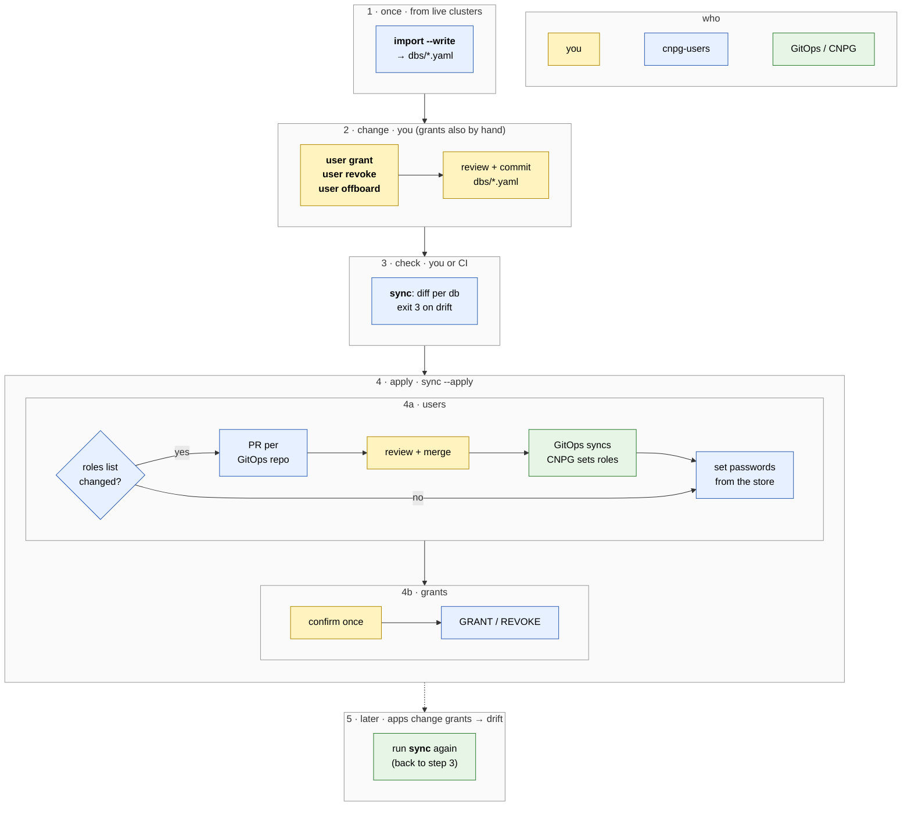

# cnpg-users-grants

For many [CloudNativePG](https://cloudnative-pg.io) clusters deployed by GitOps (ArgoCD, FluxCD, …), managed from one directory of YAML files:

- **Human users.** Grant, revoke and offboard people on every cluster in one place, with one password per person everywhere (AWS SSM, GCP Secret Manager or sops). Role changes arrive as PRs to your GitOps repos and take effect once a person merges them. App roles are listed for reference and never touched.
- **Grants.** Every role's grants, apps included, as reviewable code. Migrations and one-off SQL set most of them; `sync` shows where a database drifts from the file (non-zero exit, so it fits CI) and the exact `GRANT`/`REVOKE` to fix it.

Nothing changes a database or repo unless you pass `--apply`.

## Workflow



`sync --apply` only opens a PR when a cluster's roles list actually has to change; otherwise it goes straight to passwords and grants.

## Quick start

Requires [uv](https://docs.astral.sh/uv/), a kubeconfig with access to the clusters, `gh` logged in (for `sync-users`) and access to your password store (AWS, GCP or sops keys).

<!-- x-release-please-start-version -->
```sh
mkdir cnpg-users-grants && cd cnpg-users-grants   # configs live in the directory you run from
cat > user_passwords_store.yaml <<'EOF'
type: aws-ssm                      # or gcp-secret-manager / sops, see Files below
aws_profile: default
aws_region: eu-central-1
aws_ssm_prefix: /cnpg-user/
EOF
mkdir dbs && cat > dbs/cloudnative-pg.my-app.prod.yaml <<'EOF'
context: my-kube-context
namespace: my-app
cluster: cloudnative-pg
repo: my-org/argocd
values_file: prod/my-app/cloudnative-pg/values.yaml
values_roles_path: roles           # where the CNPG roles list is in values_file (see below)
EOF

# fill humans/apps/grants from the live cluster
uvx --from git+https://github.com/caseycs/cnpg-users-grants@v0.2.0 cnpg-users import cloudnative-pg.my-app.prod --write
# what differs, users and grants?
uvx --from git+https://github.com/caseycs/cnpg-users-grants@v0.2.0 cnpg-users sync
```
<!-- x-release-please-end -->

`values_roles_path` is the dotted path to the list of [CNPG managed roles](https://cloudnative-pg.io/documentation/current/declarative_role_management/) inside `values_file`: `roles` when it's at the top level, `cluster.roles` when your chart nests it under `cluster:`. `sync-users` edits that list.

<!-- x-release-please-start-version -->
`uvx` fetches and caches the tool on first use. The examples pin the latest release (`@v0.2.0`); drop the `@…` to track `main`, or `uv tool install git+https://github.com/caseycs/cnpg-users-grants@v0.2.0` to keep `cnpg-users` on your PATH.
<!-- x-release-please-end -->

## Commands

| Command | What it does |
|---|---|
| `import <db> [--write] [--prune]` | Read roles and grants from the live cluster, show the diff against `dbs/<db>.yaml`; `--write` saves it. |
| `sync [<db>…] [--apply]` | Both of the below in one run: one report per db with users and grants; `--apply` does the users flow first, then grants (asks first). |
| `sync-grants [<db>…]` | Print the SQL that makes live grants match the file. |
| `sync-grants --apply [--yes]` | Run it: asks first (`--yes` skips, e.g. in CI), one transaction per database, then re-checks. |
| `sync-users [<db>…]` | Print the values.yaml change and password statements for humans. |
| `sync-users --apply` | Open one PR per GitOps repo, wait for a person to merge it and GitOps to sync it, then set passwords. |
| `user grant <name> <db>… [--role R]… [--superuser]` | Add or update a human in these db files (default role `pg_read_all_data`). |
| `user revoke <name> <db>…` | Mark the human `ensure: absent` there and drop their `grants:`. |
| `user offboard <name>` | `revoke` in every db file they're in. |
| `user list [<name>]` | Who has what, across all db files. |

Without db names, `sync` and `sync-*` run for every file in `dbs/`, `--parallel N` at a time (default 4). Exit codes: `0` in sync, `3` drift, `1` error, `2` usage.

## Granting and offboarding people

Two steps: `user …` only edits the db files (review the diff, commit it); applying is separate and manual.

```sh
cnpg-users user grant alice cloudnative-pg.my-app.prod          # 1. config
cnpg-users sync-users --apply                                    # 2. PR adds the role, then her stored password is set
```

```sh
cnpg-users user offboard alice                                   # 1. ensure: absent + her grants removed, everywhere
cnpg-users sync-users                                            #    shows what still blocks dropping her role
cnpg-users sync-users --apply                                    # 2. PR marks her role ensure: absent in values.yaml
cnpg-users sync-grants --apply                                   #    REVOKE the grants she still holds
```

**Role changes go through GitOps, never straight to the cluster.** `sync-users --apply` doesn't create or drop roles itself: it commits the values.yaml changes to a branch in each GitOps repo and opens one PR per repo, labeled `cnpg-users-grants` (an open PR with that label is updated instead of opening another). Someone reviews and merges it; ArgoCD or Flux syncs the new roles list, and CNPG creates or drops the roles. The tool waits meanwhile, checking the clusters every 10 seconds for up to `--apply-timeout` (default 180 s), and sets passwords only once the roles exist. If nobody merges in time, it stops without setting them; run it again after the merge.

CNPG can't drop a role that still owns objects or holds privileges. `sync-users` lists those per database with the `REASSIGN OWNED … DROP OWNED …` to run first. Roles are cluster-wide: granting a human in a db file gives them access on every database of that cluster. Passwords are generated in the store on first `--apply` if missing, and aren't deleted on offboarding.

## Files

`dbs/<db>.yaml`, one per database:

```yaml
context: my-kube-context           # kubeconfig context
namespace: my-app
cluster: cloudnative-pg            # CNPG Cluster name
repo: my-org/argocd                # where the CNPG values.yaml lives
values_file: prod/my-app/cloudnative-pg/values.yaml
values_roles_path: roles           # path to the CNPG roles list in values_file (default: roles)
online: true                       # false: skip this db
ignored_grantees: [pg_monitor]     # skip these roles' table/sequence grants (schema, database and default privileges still managed)
humans:
  - name: alice
    superuser: false
    roles: [pg_read_all_data]
  - name: bob
    ensure: absent                 # offboarded, role not dropped yet
apps: [webapp, workers]            # application roles, for reference only: never changed
grants:
  app_db:                          # database
    workers:                       # grantee
      - GRANT SELECT, INSERT ON TABLE public.events TO workers;
      - GRANT SELECT, USAGE ON SEQUENCE public.events_id_seq TO workers;
```

`user_passwords_store.yaml`: where human passwords live. Pick one `type`:

```yaml
type: aws-ssm                      # default: one SecureString parameter per role, <prefix><role>
aws_profile: default
aws_region: eu-central-1
aws_ssm_prefix: /cnpg-user/
```

```yaml
type: gcp-secret-manager           # one secret per role, <prefix><role>; Application Default Credentials
gcp_project: my-project
gcp_secret_prefix: cnpg-user-      # default
```

```yaml
type: sops                         # one encrypted file: {role: password}; any sops key (age, KMS, PGP)
sops_file: passwords.sops.yaml     # relative to the current directory
```

<!-- x-release-please-start-version -->
GCP needs the `gcp` extra: `uvx --from 'cnpg-users-grants[gcp] @ git+https://github.com/caseycs/cnpg-users-grants@v0.2.0' cnpg-users …`.
<!-- x-release-please-end -->
 The sops store needs `sops` on the PATH; new passwords are written with `sops set --value-stdin`, so they never appear in process listings.

## How grants are written

`import` turns live grants into the shortest list of statements that reproduces them exactly, and `sync-grants` expands that list back before comparing. Two things get collapsed:

**All objects in a schema.** Privileges a role holds on every table of a schema (views and materialized views count as tables) become one `ON ALL TABLES IN SCHEMA` statement; the same for sequences. Anything extra is listed per object:

```yaml
workers:
  - GRANT SELECT ON ALL TABLES IN SCHEMA public TO workers;    # every table has SELECT
  - GRANT INSERT, UPDATE ON TABLE public.events TO workers;    # plus more on one of them
```

A privilege missing on even one table isn't collapsed, since `ON ALL …` would grant it there too. So one table the role has no grant on keeps the whole schema listed table by table.

**Partitions.** A grant on a partitioned table covers all its partitions (declarative partitioning, at any depth); a partition is listed only for privileges beyond its parent's:

```yaml
  - GRANT SELECT, INSERT ON TABLE public.events TO workers;    # also events_2026_09, events_2026_10, …
```

`ON ALL …` and parent grants mean the objects that exist *when `sync-grants` runs*. A table or partition created later without the grant shows up as `To add`, so new objects get the same access as the rest instead of drifting silently.

A role's privileges on objects it owns are implicit and never listed. `import` checks that its output expands back to exactly the live grants and warns if not.

## How roles are classified

`import` decides, per live role:

- **skipped**: `pg_*` / `cnpg_*` built-ins, CNPG-reserved roles, `ensure: absent`
- **app**: a `DatabaseRole` CR, or a password from a k8s secret
- **human**: a password in the store
- **app**: everything else

## Good to know

- `import --write` rebuilds `grants:` from the live cluster, so apply pending grant SQL first. For `humans:` it keeps edits not applied yet (a new human not created yet, `ensure: absent` until the role is gone, changed roles); `--prune` takes live as-is.
- `--apply` reuses an open PR labeled `cnpg-users-grants` (rewriting its branch) instead of opening a new one.
- Password statements carry a SCRAM verifier computed locally, never the plaintext. Missing passwords are generated and stored on `--apply`.
- EKS logins are signed in-process with boto3; other kubeconfig auth works as usual.

## Development

Releases are cut by [release-please](.github/workflows/release.yml): merging the release PR it maintains tags that commit, publishes the GitHub Release, and attaches the sdist and wheel. Version bumps come from [conventional commits](https://www.conventionalcommits.org): `feat:` and `fix:` subjects move the version and appear in the changelog.

Needs [Task](https://taskfile.dev); integration tests also need Docker and [kind](https://kind.sigs.k8s.io).

```sh
task                             # unit tests (same as: task test)
task test:integration            # kind cluster + CNPG operator, then end-to-end tests against it
task kind:down                   # delete the kind cluster
uv run cnpg-users sync-grants    # run from the checkout (configs from the current directory)
```

The integration tests create a throwaway namespace with a one-instance CNPG `Cluster` and run `import`, `sync-grants --apply`, `sync-users` passwords (including a real login) and the drop-blocker report against it. GitHub and the password store are faked (the stores have their own tests, sops against a real `sops`). `CNPG_IT_KEEP=1` keeps the namespace for debugging.
